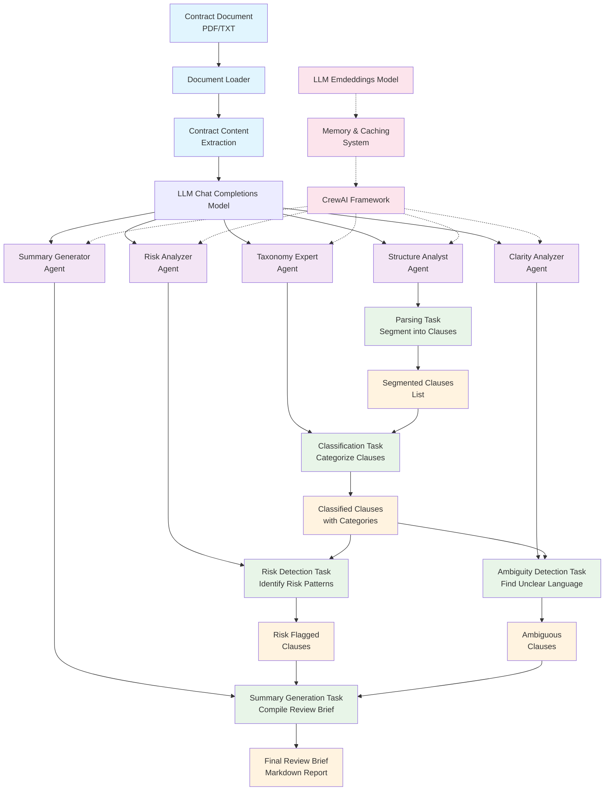

```mermaid
graph TD
    A[Contract Document<br/>PDF/TXT] --> B[Document Loader]
    B --> C[Contract Content<br/>Extraction]
    C --> D[LLM Chat Completions Model]

    D --> E[Structure Analyst<br/>Agent]
    D --> F[Taxonomy Expert<br/>Agent]
    D --> G[Risk Analyzer<br/>Agent]
    D --> H[Clarity Analyzer<br/>Agent]
    D --> I[Summary Generator<br/>Agent]

    E --> J[Parsing Task<br/>Segment into Clauses]
    F --> K[Classification Task<br/>Categorize Clauses]
    G --> L[Risk Detection Task<br/>Identify Risk Patterns]
    H --> M[Ambiguity Detection Task<br/>Find Unclear Language]
    I --> N[Summary Generation Task<br/>Compile Review Brief]

    J --> O[Segmented Clauses<br/>List]
    K --> P[Classified Clauses<br/>with Categories]
    L --> Q[Risk Flagged<br/>Clauses]
    M --> R[Ambiguous<br/>Clauses]
    N --> S[Final Review Brief<br/>Markdown Report]

    O --> K
    P --> L
    P --> M
    Q --> N
    R --> N

    T[CrewAI Framework] -.-> E
    T -.-> F
    T -.-> G
    T -.-> H
    T -.-> I

    U[Memory & Caching<br/>System] -.-> T
    V[LLM Emdeddings Model] -.-> U

    classDef input fill:#e1f5fe
    classDef agent fill:#f3e5f5
    classDef task fill:#e8f5e8
    classDef output fill:#fff3e0
    classDef framework fill:#fce4ec

    class A,B,C input
    class E,F,G,H,I agent
    class J,K,L,M,N task
    class O,P,Q,R,S output
    class T,U,V framework
```
